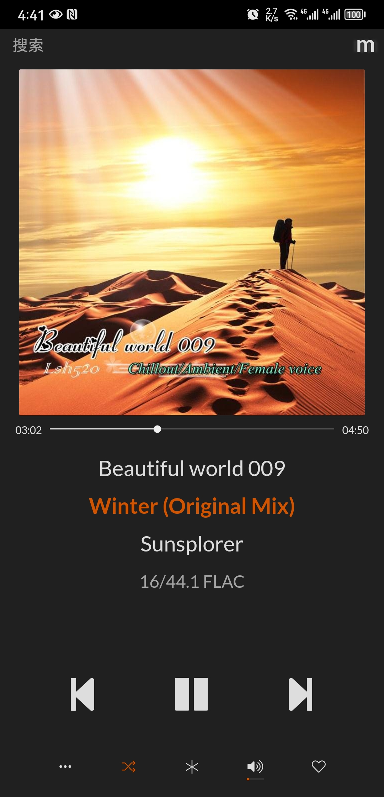
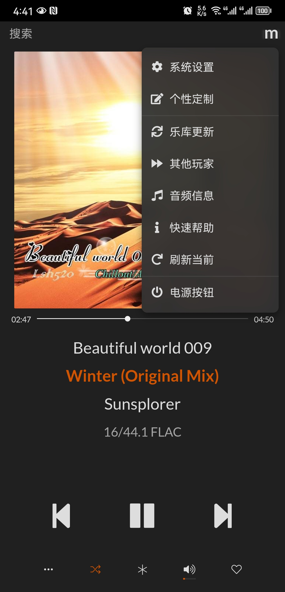
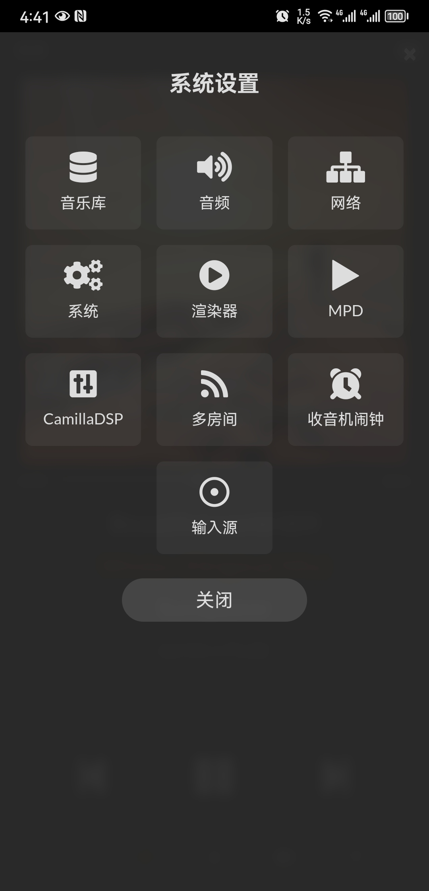
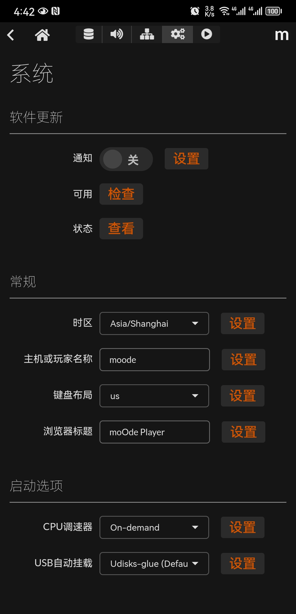
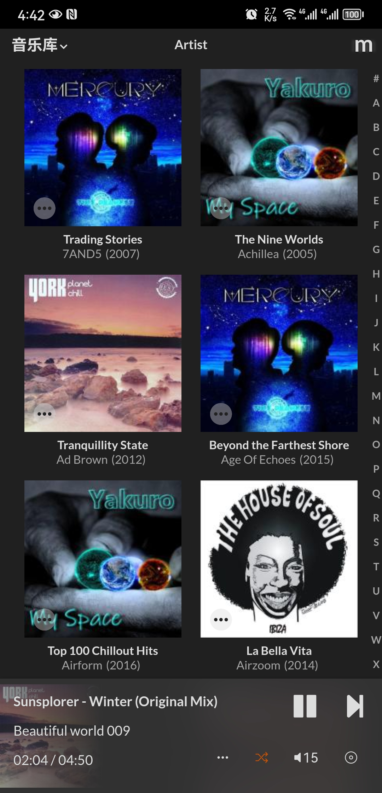
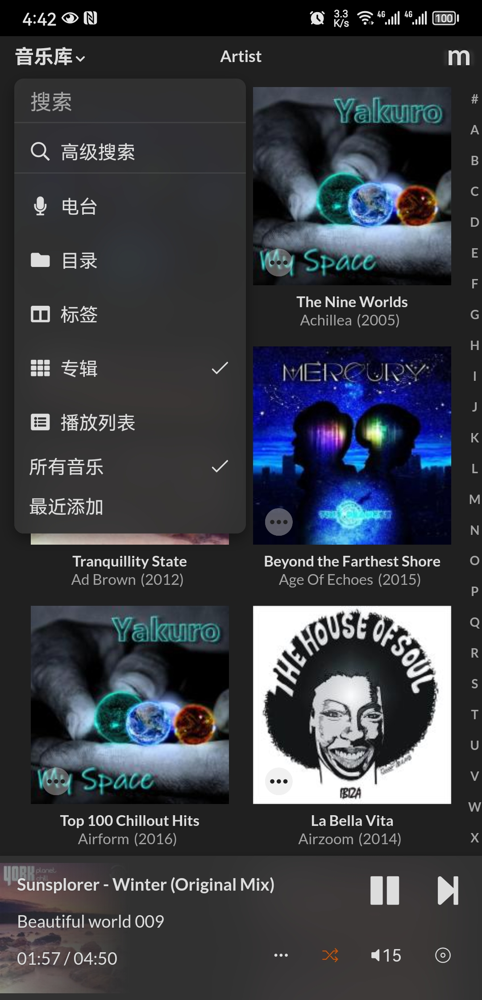
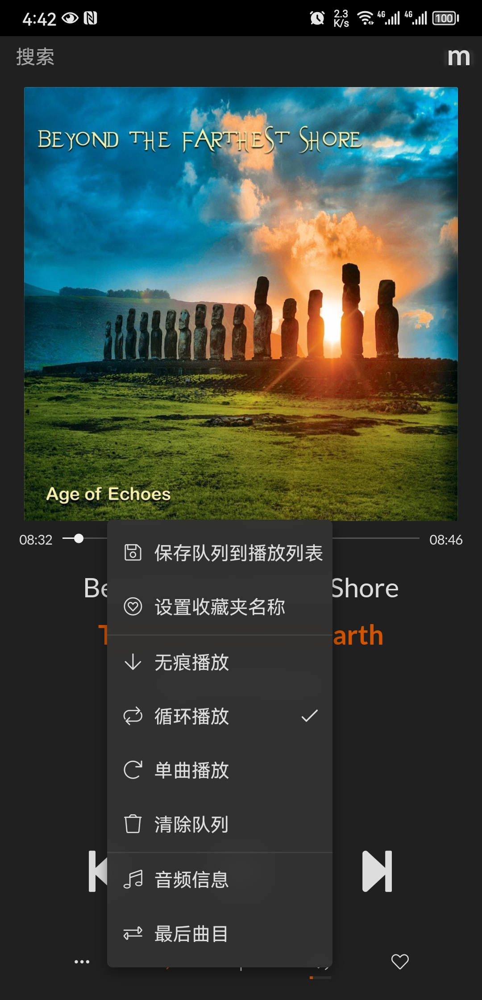

# moOde audioplay zh_CN

#### 介绍
MoOde Audio Player是MPD出色的WebUI音频播放器客户端的衍生产品，最初由Andrea Coiutti和Simone De Gregori设计和编码，随后通过RaspyFi/Volumio项目的早期努力进行了增强。

汉化文件适用版本：Release: 8.2.4 2022-12-27

汉化文件适用版本：Release: 8.3.3 2023-06-08

#### 软件架构
无复杂架构一说，就是替换固件相关目录下的文件

#### 软件下载

包含：
moOde 8.2.4s 英文原版

核心隔离脚本

moOde8.3.3 英文原版

汉化包

链接: https://pan.baidu.com/s/1_jJYeUOIVJclCaAXVl9pQg?pwd=y3c8 提取码: y3c8

#### 安装教程

 **详细安装教程请参阅：moOde系统和桥安装以及汉化说明.pdf** 

1.  有三种或以上方式安装汉化文件
    
a.在制作moOde系统TF卡启动盘的时候，使用“树莓派镜像烧录器”刷入8.2.4s系统镜像，刷入前在选项菜单勾选开启ssh服务，开启设置用户名密码，然后使用通过WinSCP软件，ssh访问moode系统，使用刷写系统时建立的权号登陆，上传汉化文件到~/目录，最后，在浏览器访问moOde系统，系统设置中打开ssh，sudo -i ，进入root模式，最后，cp ~/www /var/www 大功告成。

b.使用diskgens软件，读取moode系统的tf卡，复制汉化文件到相应目录替换目标文件。

c.在linux系统环境下，读取moode系统的tf卡，复制汉化文件到相应目录替换目标文件。

#### 使用说明

1.  插上moode系统tf卡到树梅派主版上，接通电源，开机，稍等30秒；
2.  http://moode.local登陆；打开路由器，进入dhcp分配页，可以看到moode；当然，如果以前登陆过，继续原来ip；
3.  其他未说明的。

#### 汉化效果

#### 参与贡献

1.  Fork 本仓库
2.  部分借鉴6.4.0版汉化作者“八楼B座”的汉化成果，感谢！
