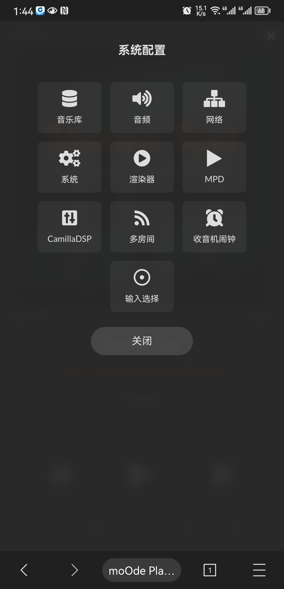
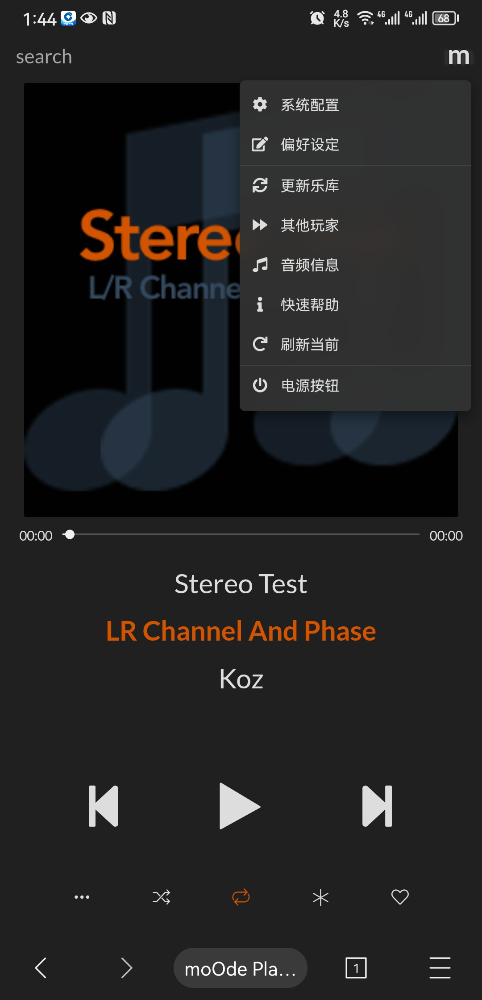
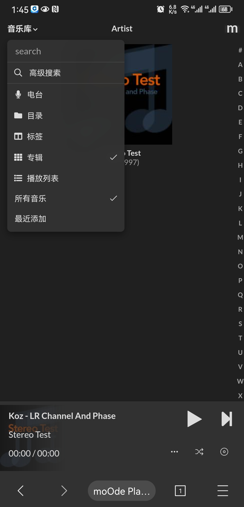
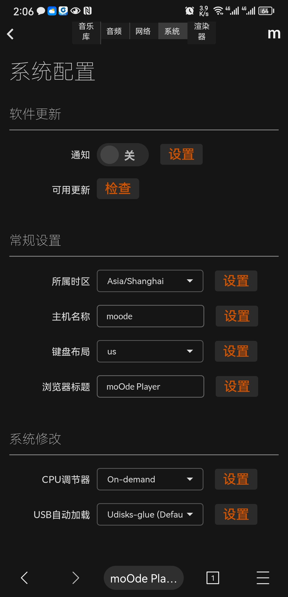

# moOde audioplay zh_CN

#### 介绍
MoOde Audio Player是MPD出色的WebUI音频播放器客户端的衍生产品，最初由Andrea Coiutti和Simone De Gregori设计和编码，随后通过RaspyFi/Volumio项目的早期努力进行了增强。
汉化文件适用版本：Release: 8.2.4 2022-12-27

#### 软件架构
无复杂架构一说，就是替换固件相关目录下的文件

#### 软件下载

链接: https://pan.baidu.com/s/1_jJYeUOIVJclCaAXVl9pQg?pwd=y3c8 提取码: y3c8 

#### 安装教程

1.  有三种或以上方式安装汉化文件
    a.通过ssh访问moode系统，root权限帐号登陆，上传汉化文件到相应目录替换目标文件。
    b.使用diskgens软件，读取moode系统的tf卡，复制汉化文件到相应目录替换目标文件。
    c.在linux系统环境下，读取moode系统的tf卡，复制汉化文件到相应目录替换目标文件。
2.  暂时没有
3.  还是没有

#### 使用说明

1.  插上moode系统tf卡到树梅派主版上，接通电源，开机，稍等30秒；
2.  http://moode.local登陆；打开路由器，进入dhcp分配页，可以看到moode；当然，如果以前登陆过，继续原来ip；
3.  其他未说明的。

#### 汉化效果

#### 参与贡献

1.  Fork 本仓库
2.  部分借鉴6.4.0版汉化作者“八楼B座”的汉化成果，感谢！

#### 特技

1.  使用 Readme\_XXX.md 来支持不同的语言，例如 Readme\_en.md, Readme\_zh.md
2.  Gitee 官方博客 [blog.gitee.com](https://blog.gitee.com)
3.  你可以 [https://gitee.com/explore](https://gitee.com/explore) 这个地址来了解 Gitee 上的优秀开源项目
4.  [GVP](https://gitee.com/gvp) 全称是 Gitee 最有价值开源项目，是综合评定出的优秀开源项目
5.  Gitee 官方提供的使用手册 [https://gitee.com/help](https://gitee.com/help)
6.  Gitee 封面人物是一档用来展示 Gitee 会员风采的栏目 [https://gitee.com/gitee-stars/](https://gitee.com/gitee-stars/)
